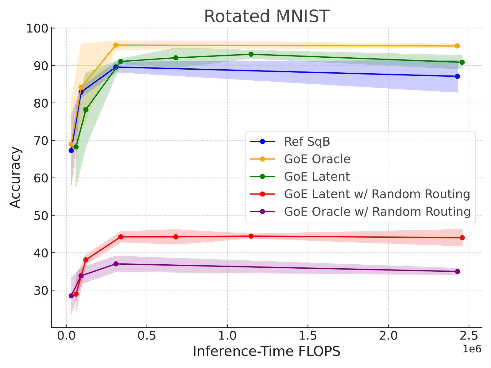

# Graph of Experts
Group Members: Catherine Tang, Jagdeep Bhatia, Nolan Fey, Younghyo Park, Ezra Erives

# Introduction
In Graph of Experts (GoE), we seek to train a neural network that disentangles inference-time compute with overall network capacity by compartmentalizing knowledge within subnetworks. 

By structuring our neural network as a graph of NN modules, we use a global router to select a path at runtime so the input traverses a single path.

Our global router consists of a VQ-VAE (implementation from this [repo](https://github.com/MishaLaskin/vqvae)) combined with heirarchical clustering. For our two image classification tasks (digit classification and binary prediction of facial attributes), our GoE is structured as a CNN.  

# Getting Started
## Installation
Create a conda or virtual environment. Then run:
```pip install -r requirements.txt```

## Run Experiments
```
python train_celeba.py --experiment_name celeba_test --num_workers 5 --num_epochs 25 --num_runs 5
```
To run on MNIST dataset, run `train_mnist.py` instead. To visualize results, run `results.ipynb`.

### Scripts
- `ablation_celeba.py`: Ablation experiment of random routing on GoE Oracle and GoE on CelebA
- `ablation_mnist.py`: Ablation experiment of random routing on GoE Oracle and GoE on MNIST
- `train_celeba`: Train GoE and Ref models on CelebA
- `train_mnist`: Train GoE and Ref models on MNIST

### Analysis
- `results.ipynb`: Analyze training results and generate accuracy vs. inference-time flops graph

### Example Notebooks
- `mnist_final.ipynb`: Run training on rotated MNIST dataset
- `binary.ipnyb`: Setup binary tree GoE
- `data.ipynb`: Visualize datasets
- `kmeans.ipynb`: VQ-VAE and clustering-based routers for both datasets

## Pre-Trained Models
Models were checkpointed after training on Rotated MNIST task. To use checkpointed models, unzip file `checkpoints/rotated_mnist/rotated_mnist_test.zip`

# Experiments
We tested out the accuracy of 5 different models on 2 tasks.

## Models
1. Ref SqB: Reference Status Quo model where all model parameters at training time are used at inference time (B is an artifact of previous naming scheme)
2. GoE Oracle: Graph of Expert + Oracle Router that routes given the metadata labels of input data
3. GoE Latent: Graph of Expert + Latent Router that routes based on learned metadata labels with VQ-VAE
4. GoE Oracle w/ Random Routing: Trained GoE Oracle model evaluated with random routing at inference time
5. GoE Latent w/ Random Routing: Trained GoE Latent model evaluated with random routing at inference time

## Tasks
1. Rotated MNIST: We took the MNIST dataset and applied transformations to get 4 different versions of the dataset to inform the route selection for the GoE Oracle router. The four groups were labeled with metadata lables corresponding to the applied rotation (0, 90, 180, 270 degrees) and the unrotated (0 degrees) cluster also had a color inversion applied. The final task on this dataset is digit classification.


2. CelebA: We partitioned the celeb faces dataset into 8 groups based on three binary attributes ("Black_Hair", "Arched_Eyebrows", "Oval_Face"). The final task was binary prediction of the "Male" attribute.


# Results
Rotated MNIST Experiment Results:


CelebA Experiment Results:

